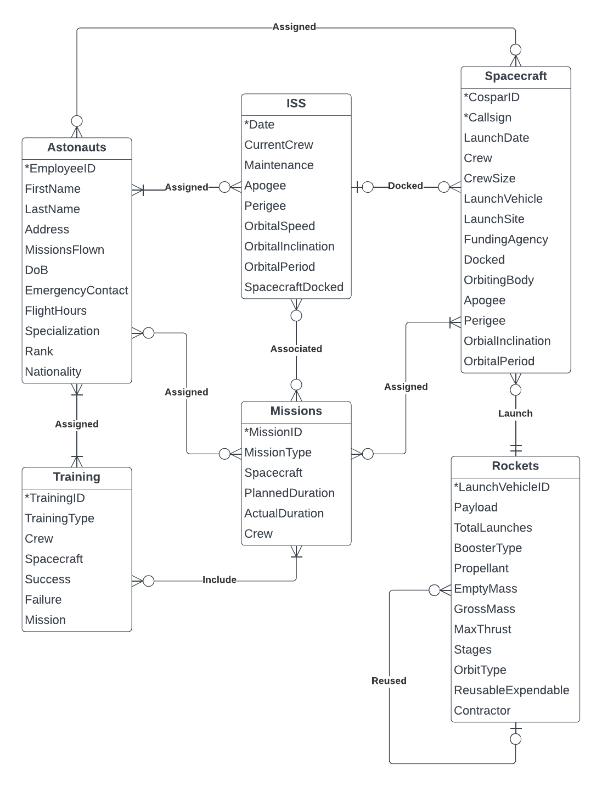

# NASA Astronaut and Mission Database

An example of Relational Database Design.

---

## Table of Contents 
- [Step 1: Background - NASA Database](#back)
- [Step 2: Build the Entity Relationship Model](#erm)
- [Step 3: Create the Entity Relationship Diagram](#erd)
- [Step 4: Convert to a Relational Model](#rm)
- [Step 5: Normalize the Relational Model](#norm)
    - [Mapping Functional Dependencies](#FD)
    - [First Normal Form (1NF)](#1nf)
    - [Second Normal Form (2NF)](#2nf)
    - [Third Normal Form (3NF)](#3nf)
- [Step 6: Finalized Relational Model](#final)

---

## Step 1:

### Background 

With the predicted increase in solar activity this year, NASA is building contingency plans for all of their systems. An unfortunately timed coronal mass ejection (CME) with total ejected mass equal to or greater than the Carrington Event in 1859 has potential to devastate unprotected power transmission, communications, and electronics systems globally in a way we haven't seen since the adoption of modern technologies.

 NASA has put out a contract to design a replacement database that stores all their previous and upcoming mission information. This database would include information on Astronauts, Missions, Training, Launch Vehicles, Spacecraft, and daily information about the International Space Station (ISS).

## Step 2:

### Build the Entity Relationship Model 

*Note: An asterisk (\*) denotes a primary key or candidate key of the entity.*

**Entities:**
- `Astronauts`: *EmployeeID, FirstName, LastName, Address, MissionsFlown, DoB, EmergencyContact, FlightHours, Specialization, Rank, Nationality
- `ISS`: *Date, CurrentCrew, Maintenance, Apogee, Perigee, OrbitalSpeed, OrbitalInclination, OrbitalPeriod, SpacecraftDocked
- `Spacecraft`: *CosparID, *Callsign, LaunchDate, Crew, CrewSize, LaunchVehicle, LaunchSite, FundingAgency, Docked, OrbitingBody, Apogee, Perigee, OrbitalInclination, OrbitalPeriod
- `Rockets`: *LaunchVehicleID, Payload, TotalLaunches, BoosterType, Propellant, EmptyMass, GrossMass, MaxThrust, Stages, OrbitType, ReusableExpendable, Contractor
- `Missions`: *MissionID, MissionType, Spacecraft, PlannedDuration, ActualDuration, Crew
- `Training`: *TrainingID, TrainingType, Crew, Spacecraft, Success, Failure, Mission

**Relationships:**
- `Astronauts` may be on one or more `ISS` mission; `ISS` must have one or more `Astronauts` onboard.
- `Astronauts` may be a crew member on one or more `Spacecraft`; `Spacecraft` may have one or more `Astronauts` as crew.
- `Astronauts` may be assigned to one or more `Mission`; `Missions` may have one or more `Astronauts` assigned to them.
- `ISS` may have one or more `Spacecraft` docked to it; `Spacecraft` may be docked to one and only one the `ISS`.
- `ISS` may be associated with one or more `Missions`; `Missions` may be associated with one or more `ISS`.
- `Spacecraft` must be launched by one and only one `Rocket`; `Rockets` may launch one or more `Spacecraft`.
- `Spacecraft` may be assigned one or more `Missions`; `Missions` must assign one or more `Spacecraft`.
- `Rockets` may be reused one or more times (`Rockets`); `Rockets` may reference one and only one reused `Rockets` (previous launch).
- `Missions` may include one more more `Training`; `Training` must reference one or more `Missions`.
- `Training` must be assigned to one or more `Astronauts`; `Astronauts` must be assigned one or more `Training`.

## Step 3:

### Create the Entity Relationship Diagram 

## Step 4:

### Convert the ERD to the Relational Model 

*Note: An <u>underline</u> denotes a primary key or candidate key of the relation, and (fk) denotes a foreign key.*

**Relations:**
- `Astronauts` (<u>EmployeeID</u>, FirstName, LastName, Address, MissionsFlown, DoB, EmergencyContact, FlightHours, Specialization, Rank, Nationality)
- `Spacecraft_Crew` (<u>EmployeeID(fk)</u>, <u>CosparID(fk)</u>)
- `Astronaut_Training` (<u>EmployeeID(fk)</u>, <u>TrainingID(fk)</u>)
- `ISS_Crew` (<u>EmployeeID(fk)</u>, <u>Date(fk)</u>)
- `Assigned_Missions` (<u>EmployeeID(fk)</u>, <u>MissionID(fk)</u>)
- `ISS` (<u>Date</u>, CurrentCrew, Maintenance, Apogee, Perigee, OrbitalSpeed, OrbitalInclination, OrbitalPeriod, SpacecraftDocked)
- `ISS_Missions` (<u>Date(fk)</u>, <u>MissionID(fk)</u>)
- `Spacecraft` (<u>CosparID</u>, <u>Callsign</u>, LaunchDate, Crew, CrewSize, LaunchVehicle, LaunchSite, FundingAgency, Docked, OrbitingBody, Apogee, Perigee, OrbitalInclination, OrbitalPeriod, DockedDate(fk))
- `Spacecraft_Missions` (<u>CosparID(fk)</u>, <u>MissionID(fk)</u>)
- `Spacecraft_Rocket` (<u>CosparID(fk)</u>, <u>LaunchVehicleID(fk)</u>)
- `Rockets` (<u>LaunchVehicleID</u>, Payload, TotalLaunches, BoosterType, Propellant, EmptyMass, GrossMass, MaxThrust, Stages, OrbitType, ReusableExpendable, Contractor, ReusedLaunchVehicleID(fk))
- `Missions` (<u>MissionID</u>, MissionType, Spacecraft, PlannedDuration, ActualDuration, Crew)
- `Training` (<u>TrainingID</u>, TrainingType, Crew, Spacecraft, Success, Failure, Mission)
- `Training_Missions` (<u>MissionID(fk)</u>, <u>TrainingID(fk)</u>)

## Step 5:

### Normalize the Relational Model to 3NF 

Before normalization, we need to map out the Functional Dependencies (FD) of the relations (how some attributes are dependant on the primary keys, or attributes that are dependant on other attributes.):

*Note: An arrow (→) denotes the attributes on the right are functionally dependent on the attributes/primary keys on the left.*

**Functional Dependencies:**
- `Astronauts` (<u>EmployeeID</u>, FirstName, LastName, Address, MissionsFlown, DoB, EmergencyContact, FlightHours, Specialization, Rank, Nationality)
    - FD1: <u>EmployeeID</u> → FirstName, LastName, Address, MissionsFlown, DoB, EmergencyContact, FlightHours, Specialization, Rank, Nationality
- `Spacecraft_Crew` (<u>EmployeeID(fk)</u>, <u>CosparID(fk)</u>)
    - No non-primary-key attributes; no dependencies.
- `Astronaut_Training` (<u>EmployeeID(fk)</u>, <u>TrainingID(fk)</u>)
    - No non-primary-key attributes; no dependencies.
- `ISS_Crew` (<u>EmployeeID(fk)</u>, <u>Date(fk)</u>)
    - No non-primary-key attributes; no dependencies.
- `Assigned_Missions` (<u>EmployeeID(fk)</u>, <u>MissionID(fk)</u>)
    - No non-primary-key attributes; no dependencies.
- `ISS` (<u>Date</u>, CurrentCrew, Maintenance, Apogee, Perigee, OrbitalSpeed, OrbitalInclination, OrbitalPeriod, SpacecraftDocked)
    - FD1: <u>Date</u> → CurrentCrew, Maintenance, Apogee, Perigee, OrbitalSpeed, OrbitalInclination, OrbitalPeriod, SpacecraftDocked
    - FD2: Apogee, Perigee, OrbitalSpeed → OrbitalPeriod
- `ISS_Missions` (<u>Date(fk)</u>, <u>MissionID(fk)</u>)
    - No non-primary-key attributes; no dependencies.
- `Spacecraft` (<u>CosparID</u>, <u>Callsign</u>, LaunchDate, Crew, CrewSize, LaunchVehicle, LaunchSite, FundingAgency, Docked, OrbitingBody, Apogee, Perigee, OrbitalInclination, OrbitalPeriod, DockedDate(fk))
    - FD1: <u>CosparID</u>, <u>Callsign</u> → LaunchDate, Crew, CrewSize, LaunchVehicle, LaunchSite, FundingAgency, Docked, OrbitingBody, Apogee, Perigee, OrbitalInclination, OrbitalPeriod, DockedDate(fk)
    - FD2: <u>Callsign</u> → Crew, CrewSize
    - FD3: Docked → DockedDate(fk)
- `Spacecraft_Missions` (<u>CosparID(fk)</u>, <u>MissionID(fk)</u>)
    - No non-primary-key attributes; no dependencies.
- `Spacecraft_Rocket` (<u>CosparID(fk)</u>, <u>LaunchVehicleID(fk)</u>)
    - No non-primary-key attributes; no dependencies.
- `Rockets` (<u>LaunchVehicleID</u>, Payload, TotalLaunches, BoosterType, Propellant, EmptyMass, GrossMass, MaxThrust, Stages, OrbitType, ReusableExpendable, Contractor, ReusedLaunchVehicleID(fk))
    - FD1: <u>LaunchVehicleID</u> → Payload, TotalLaunches, BoosterType, Propellant, EmptyMass, GrossMass, MaxThrust, Stages, OrbitType, ReusableExpendable, Contractor, ReusedLaunchVehicleID(fk)
    - FD2: ReusableExpendable → TotalLaunches
- `Missions` (<u>MissionID</u>, MissionType, Spacecraft, PlannedDuration, ActualDuration, Crew)
    - FD1: <u>MissionID</u> → MissionType, Spacecraft, PlannedDuration, ActualDuration, Crew
- `Training` (<u>TrainingID</u>, TrainingType, Crew, Spacecraft, Success, Failure, Mission)
    - FD1: <u>TrainingID</u> → TrainingType, Crew, Spacecraft, Success, Failure, Mission
    - FD2: TrainingType → Crew
- `Training_Missions` (<u>MissionID(fk)</u>, <u>TrainingID(fk)</u>)
    - No non-primary-key attributes; no dependencies.

### First Normal Form (1NF) 

*For ease of following along, relations with no functional dependencies will be removed temporarily until the the end of conversions.*

- `Astronauts` (<u>EmployeeID</u>, FirstName, LastName, Address, MissionsFlown, DoB, EmergencyContact, FlightHours, Specialization, Rank, Nationality)
    - FD1: <u>EmployeeID</u> → FirstName, LastName, Address, MissionsFlown, DoB, EmergencyContact, FlightHours, Specialization, Rank, Nationality
- `ISS` (<u>Date</u>, CurrentCrew, Maintenance, Apogee, Perigee, OrbitalSpeed, OrbitalInclination, OrbitalPeriod, SpacecraftDocked)
    - FD1: <u>Date</u> → CurrentCrew, Maintenance, Apogee, Perigee, OrbitalSpeed, OrbitalInclination, OrbitalPeriod, SpacecraftDocked
    - FD2: Apogee, Perigee, OrbitalSpeed → OrbitalPeriod
- `Spacecraft` (<u>CosparID</u>, <u>Callsign</u>, LaunchDate, Crew, CrewSize, LaunchVehicle, LaunchSite, FundingAgency, Docked, OrbitingBody, Apogee, Perigee, OrbitalInclination, OrbitalPeriod, DockedDate(fk))
    - FD1: <u>CosparID</u>, <u>Callsign</u> → LaunchDate, Crew, CrewSize, LaunchVehicle, LaunchSite, FundingAgency, Docked, OrbitingBody, Apogee, Perigee, OrbitalInclination, OrbitalPeriod, DockedDate(fk)
    - FD2: <u>Callsign</u> → Crew, CrewSize
    - FD3: Docked → DockedDate(fk)
- `Rockets` (<u>LaunchVehicleID</u>, Payload, TotalLaunches, BoosterType, Propellant, EmptyMass, GrossMass, MaxThrust, Stages, OrbitType, ReusableExpendable, Contractor, ReusedLaunchVehicleID(fk))
    - FD1: <u>LaunchVehicleID</u> → Payload, TotalLaunches, BoosterType, Propellant, EmptyMass, GrossMass, MaxThrust, Stages, OrbitType, ReusableExpendable, Contractor, ReusedLaunchVehicleID(fk)
    - FD2: ReusableExpendable → TotalLaunches
- `Missions` (<u>MissionID</u>, MissionType, Spacecraft, PlannedDuration, ActualDuration, Crew)
    - FD1: <u>MissionID</u> → MissionType, Spacecraft, PlannedDuration, ActualDuration, Crew
- `Training` (<u>TrainingID</u>, TrainingType, Crew, Spacecraft, Success, Failure, Mission)
    - FD1: <u>TrainingID</u> → TrainingType, Crew, Spacecraft, Success, Failure, Mission
    - FD2: TrainingType → Crew

**Changes made for conversion from relational model to 1NF**:

- None, the relational model is already in 1NF.

### Second Normal Form (2NF) 

*For ease of following along, relations with no functional dependencies will be removed temporarily until the the end of conversions.*

- `Astronauts` (<u>EmployeeID</u>, FirstName, LastName, Address, MissionsFlown, DoB, EmergencyContact, FlightHours, Specialization, Rank, Nationality)
    - FD1: EmployeeID → FirstName, LastName, Address, MissionsFlown, DoB, EmergencyContact, FlightHours, Specialization, Rank, Nationality
- `ISS` (<u>Date</u>, CurrentCrew, Maintenance, Apogee, Perigee, OrbitalSpeed, OrbitalInclination, OrbitalPeriod, SpacecraftDocked)
    - FD1: <u>Date</u> → CurrentCrew, Maintenance, Apogee, Perigee, OrbitalSpeed, OrbitalInclination, OrbitalPeriod, SpacecraftDocked
    - FD2: Apogee, Perigee, OrbitalSpeed → OrbitalPeriod
- `Spacecraft` (<u>CosparID</u>, <u>Callsign(fk)</u>, LaunchDate, ~~Crew~~, ~~CrewSize~~, LaunchVehicle, LaunchSite, FundingAgency, Docked, OrbitingBody, Apogee, Perigee, OrbitalInclination, OrbitalPeriod, DockedDate(fk))
    - FD1: <u>CosparID</u>, <u>Callsign(fk)</u> → LaunchDate, ~~Crew~~, ~~CrewSize~~, LaunchVehicle, LaunchSite, FundingAgency, Docked, OrbitingBody, Apogee, Perigee, OrbitalInclination, OrbitalPeriod, DockedDate(fk)
    - ~~FD2: <u>Callsign</u> → Crew, CrewSize~~
    - FD3: Docked → DockedDate(fk)
- `Spacecraft_Callsign_Crew` (<u>Callsign</u>, Crew, CrewSize)
    - FD1: <u>Callsign</u> → Crew, CrewSize
- `Rockets` (<u>LaunchVehicleID</u>, Payload, TotalLaunches, BoosterType, Propellant, EmptyMass, GrossMass, MaxThrust, Stages, OrbitType, ReusableExpendable, Contractor, ReusedLaunchVehicleID(fk))
    - FD1: <u>LaunchVehicleID</u> → Payload, TotalLaunches, BoosterType, Propellant, EmptyMass, GrossMass, MaxThrust, Stages, OrbitType, ReusableExpendable, Contractor, ReusedLaunchVehicleID(fk)
    - FD2: ReusableExpendable → TotalLaunches
- `Missions` (<u>MissionID</u>, MissionType, Spacecraft, PlannedDuration, ActualDuration, Crew)
    - FD1: <u>MissionID</u> → MissionType, Spacecraft, PlannedDuration, ActualDuration, Crew
- `Training` (<u>TrainingID</u>, TrainingType, Crew, Spacecraft, Success, Failure, Mission)
    - FD1: <u>TrainingID</u> → TrainingType, Crew, Spacecraft, Success, Failure, Mission
    - FD2: TrainingType → Crew

**Changes made for conversion from 1NF model to 2NF**:

- Removed all partial functional dependencies (see ~~strikethrough~~ notation and new foreign keys (fk)).
    - In `Spacecraft`, turn <u>Callsign</u> into a foreign key, remove Crew and CrewSize, and place them in their own relation, `Spacecraft_Callsign_Crew` keeping Callsign as the primary key.

### Third Normal Form (3NF) 

*For ease of following along, relations with no functional dependencies will be removed temporarily until the the end of conversions.*

- `Astronauts` (<u>EmployeeID</u>, FirstName, LastName, Address, MissionsFlown, DoB, EmergencyContact, FlightHours, Specialization, Rank, Nationality)
    - FD1: <u>EmployeeID</u> → FirstName, LastName, Address, MissionsFlown, DoB, EmergencyContact, FlightHours, Specialization, Rank, Nationality
- `ISS` (<u>Date</u>, CurrentCrew, Maintenance, Apogee(fk), Perigee(fk), OrbitalSpeed(fk), OrbitalInclination, ~~OrbitalPeriod~~, SpacecraftDocked)
    - FD1: <u>Date</u> → CurrentCrew, Maintenance, Apogee(fk), Perigee(fk), OrbitalSpeed(fk), OrbitalInclination, ~~OrbitalPeriod~~, SpacecraftDocked
    - ~~FD2: Apogee, Perigee, OrbitalSpeed → OrbitalPeriod~~
- `ISS_OrbitalPeriod` (<u>Apogee</u>, <u>Perigee</u>, <u>OrbitalSpeed</u>, OrbitalPeriod)
    - FD1: <u>Apogee</u>, <u>Perigee</u>, <u>OrbitalSpeed</u> → OrbitalPeriod
- `Spacecraft` (<u>CosparID</u>, <u>Callsign(fk)</u>, LaunchDate, LaunchVehicle, LaunchSite, FundingAgency, Docked(fk), OrbitingBody, Apogee, Perigee, OrbitalInclination, OrbitalPeriod, ~~DockedDate(fk)~~)
    - FD1: <u>CosparID</u>, <u>Callsign(fk)</u> → LaunchDate, LaunchVehicle, LaunchSite, FundingAgency, Docked(fk), OrbitingBody, Apogee, Perigee, OrbitalInclination, OrbitalPeriod, ~~DockedDate(fk)~~
    - ~~FD2: Docked → DockedDate(fk)~~
- `Spacecraft_Docked` (<u>Docked</u>, DockedDate(fk))
    - FD1: <u>Docked</u> → DockedDate(fk)
- `Spacecraft_Callsign_Crew` (<u>Callsign</u>, Crew, CrewSize)
    - FD1: <u>Callsign</u> → Crew, CrewSize
- `Rockets` (<u>LaunchVehicleID</u>, Payload, ~~TotalLaunches~~, BoosterType, Propellant, EmptyMass, GrossMass, MaxThrust, Stages, OrbitType, ReusableExpendable(fk), Contractor, ReusedLaunchVehicleID(fk))
    - FD1: <u>LaunchVehicleID</u> → Payload, ~~TotalLaunches~~, BoosterType, Propellant, EmptyMass, GrossMass, MaxThrust, Stages, OrbitType, ReusableExpendable(fk), Contractor, ReusedLaunchVehicleID(fk)
    - ~~FD2: ReusableExpendable → TotalLaunches~~
- `ReusedRockets` (<u>ReusableExpendable</u>, TotalLaunches)
    - FD1: <u>ReusableExpendable</u> → TotalLaunches
- `Missions` (<u>MissionID</u>, MissionType, Spacecraft, PlannedDuration, ActualDuration, Crew)
    - FD1: <u>MissionID</u> → MissionType, Spacecraft, PlannedDuration, ActualDuration, Crew
- `Training` (<u>TrainingID</u>, TrainingType(fk), ~~Crew~~, Spacecraft, Success, Failure, Mission)
    - FD1: <u>TrainingID</u> → TrainingType(fk), ~~Crew~~, Spacecraft, Success, Failure, Mission
    - ~~FD2: TrainingType → Crew~~
- `Crew_Training` (<u>TrainingType</u>, Crew)
    - FD1: <u>TrainingType</u> → Crew

**Changes made for conversion from 2NF to 3NF**:

- Removed all transitive functional dependencies (see ~~strikethrough~~ notation and new foreign keys (fk)).
    - In `ISS`, turn Apogee, Perigee, OrbitalSpeed into foreign keys, remove OrbitalPeriod, and place them in a new relation, `ISS_OrbitalPeriod`, turning Apogee, Perigee and OrbitalSpeed into primary keys.
    - In `Spacecraft`, turn Docked into a foreign key, remove DockedDate, and place them in a new relation, `Spacecraft_Docked`, making Docked the primary key.
    - In `Rockets`, turn ReusableExpendable into a foreign key, remove TotalLaunches, and place them in a new relation, `ReusedRockets`, making ReusableExpendable the primary key.
    - In `Training`, turn TrainingType into a foreign key, remove Crew, and place them in a new relation, `Crew_Training`, making TrainingType the primary key.

## Step 6:

### Finalized Relational Model - Ready for Implementation 

Final model with the temporarily removed relations without functional dependencies included.

- `Astronauts` (<u>EmployeeID</u>, FirstName, LastName, Address, MissionsFlown, DoB, EmergencyContact, FlightHours, Specialization, Rank, Nationality)
    - FD1: <u>EmployeeID</u> → FirstName, LastName, Address, MissionsFlown, DoB, EmergencyContact, FlightHours, Specialization, Rank, Nationality
- `Spacecraft_Crew` (<u>EmployeeID(fk)</u>, <u>CosparID(fk)</u>)
    - No non-primary-key attributes; no dependencies.
- `Astronaut_Training` (<u>EmployeeID(fk)</u>, <u>TrainingID(fk)</u>)
    - No non-primary-key attributes; no dependencies.
- `ISS_Crew` (<u>EmployeeID(fk)</u>, <u>Date(fk)</u>)
    - No non-primary-key attributes; no dependencies.
- `Assigned_Missions` (<u>EmployeeID(fk)</u>, <u>MissionID(fk)</u>)
    - No non-primary-key attributes; no dependencies.
- `ISS` (<u>Date</u>, CurrentCrew, Maintenance, Apogee(fk), Perigee(fk), OrbitalSpeed(fk), OrbitalInclination, SpacecraftDocked)
    - FD1: <u>Date</u> → CurrentCrew, Maintenance, Apogee(fk), Perigee(fk), OrbitalSpeed(fk), OrbitalInclination, SpacecraftDocked
- `ISS_OrbitalPeriod` (<u>Apogee</u>, <u>Perigee</u>, <u>OrbitalSpeed</u>, OrbitalPeriod)
    - FD1: <u>Apogee</u>, <u>Perigee</u>, <u>OrbitalSpeed</u> → OrbitalPeriod
- `ISS_Missions` (<u>Date(fk)</u>, <u>MissionID(fk)</u>)
    - No non-primary-key attributes; no dependencies.
- `Spacecraft` (<u>CosparID</u>, <u>Callsign(fk)</u>, LaunchDate, LaunchVehicle, LaunchSite, FundingAgency, Docked(fk), OrbitingBody, Apogee, Perigee, OrbitalInclination, OrbitalPeriod)
    - FD1: <u>CosparID</u>, <u>Callsign(fk)</u> → LaunchDate, LaunchVehicle, LaunchSite, FundingAgency, Docked(fk), OrbitingBody, Apogee, Perigee, OrbitalInclination, OrbitalPeriod
- `Spacecraft_Docked` (<u>Docked</u>, DockedDate(fk))
    - FD1: <u>Docked</u> → DockedDate(fk)
- `Spacecraft_Callsign_Crew` (<u>Callsign</u>, Crew, CrewSize)
    - FD1: <u>Callsign</u> → Crew, CrewSize
- `Spacecraft_Missions` (<u>CosparID(fk)</u>, <u>MissionID(fk)</u>)
    - No non-primary-key attributes; no dependencies.
- `Spacecraft_Rocket` (<u>CosparID(fk)</u>, <u>LaunchVehicleID(fk)</u>)
    - No non-primary-key attributes; no dependencies.
- `Rockets` (<u>LaunchVehicleID</u>, Payload, BoosterType, Propellant, EmptyMass, GrossMass, MaxThrust, Stages, OrbitType, ReusableExpendable(fk), Contractor, ReusedLaunchVehicleID(fk))
    - FD1: <u>LaunchVehicleID</u> → Payload, BoosterType, Propellant, EmptyMass, GrossMass, MaxThrust, Stages, OrbitType, ReusableExpendable(fk), Contractor, ReusedLaunchVehicleID(fk)
- `ReusedRockets` (<u>ReusableExpendable</u>, TotalLaunches)
    - FD1: <u>ReusableExpendable</u> → TotalLaunches
- `Missions` (<u>MissionID</u>, MissionType, Spacecraft, PlannedDuration, ActualDuration, Crew)
    - FD1: <u>MissionID</u> → MissionType, Spacecraft, PlannedDuration, ActualDuration, Crew
- `Training` (<u>TrainingID</u>, TrainingType(fk), Spacecraft, Success, Failure, Mission)
    - FD1: <u>TrainingID</u> → TrainingType(fk), Spacecraft, Success, Failure, Mission
- `Crew_Training` (<u>TrainingType</u>, Crew)
    - FD1: <u>TrainingType</u> → Crew
- `Training_Missions` (<u>MissionID(fk)</u>, <u>TrainingID(fk)</u>)
    - No non-primary-key attributes; no dependencies.

###### [Back to Table of Contents](#toc)
